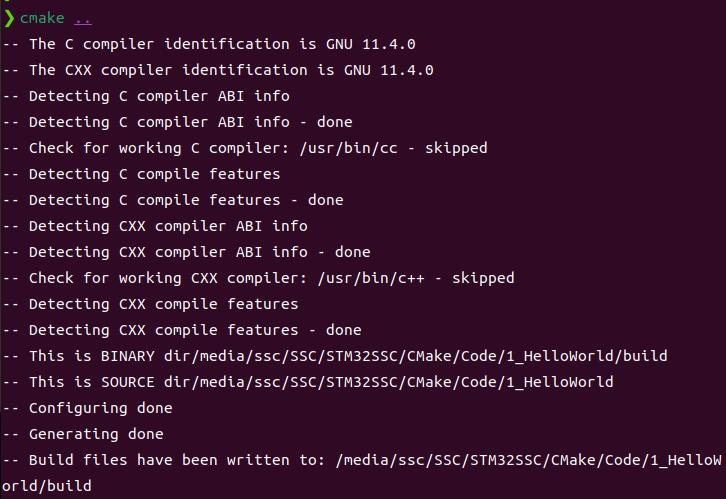
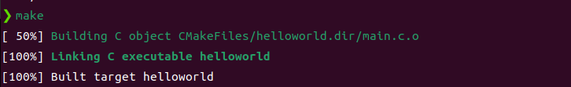

# Cmake 1_Cmake 安装和测试

## 1. CMake简介
CMake 是适用于C/C++/Java的源代码构建工具。

### Cmake 安装

```sh
sudo apt install cmake
```

可以使用以下指令检查cmake是否安装：

```sh
cmake -version
```

## 2. HelloWorld

创建文件

```sh
touch main.c
touch CMakeLists.txt
```

`main.c`文件：

```c
#include <stdio.h>

int main()
{
	printf("Hello World!\r\n");
	return 0;
}
```

`CMakeLists.txt`文件

```cmake
PROJECT(HELLOWORLD)
SET(SRC_LIST main.c)
MESSAGE(STATUS "This is BINARY dir" ${HELLOWORLD_BINARY_DIR})
MESSAGE(STATUS "This is SOURCE dir" ${HELLOWORLD_SOURCE_DIR})
ADD_EXECUTABLE(helloworld ${SRC_LIST})
```

进行编译

```sh
mkdir build
cd build
cmake ..
make
```





> `CMakeLists.txt`是`cmake`的构建定义文件，如果工程存在多个目录，需要确保每个要管理的目录都存在一个`CMakeLists.txt`。

### `PROJECT` 指令

```cmake
PROJECT(projectname [CXX] [C] [Java])
```

> - `projectname`工程名称。
> - `[CXX] [C] [Java]`支持语言列表，默认表示支持所有语言。
> - 隐式的定义了两个`cmake`变量：`{PROJECT_NAME}_BINARY_DIR`和`{PROJECT_NAME}_SOURCE_DIR`。对于内部编译而言，两个变量的路径在`main.c`所在路径下。
> - `make`系统预定义了`PROJECT_BINARY_DIR`和`PROJECT_SOURCE_DIR`
>   变量,他们的值分别跟`{PROJECT_NAME}_BINARY_DIR`与`{PROJECT_NAME}_SOURCE_DIR`一致。建议直接使用 `PROJECT_BINARY_DIR`和`PROJECT_SOURCE_DIR`,即使修改了工程名称,也不会影响这两个变量。

### `SET` 指令

```cmake
SET(VAR [VALUE] [CACHE TYPE DOCSTRING [FORCE]])
```

SET 指令可以用来显式的定义变量。

### `MESSAGE` 指令

```cmake
MESSAGE([SEND_ERROR | STATUS | FATAL_ERROR] "message to display"...)
```

> - 用于向终端输出用户定义的信息，包含了三种类型:
>   `SEND_ERROR`,产生错误,生成过程被跳过。`STATUS`,输出前缀为`—`的信息。
>   `FATAL_ERROR`,立即终止所有`cmake`过程.

### `ADD_EXECUTABLE` 指令

```cmake
ADD_EXECUTABLE(executename ${SRC_LIST})
```

生成`executename`为名的工程，相关源文件为`SRC_LIST`定义的源文件。

### 关于外部构建

CMake 建议使用外部构建方式，所有动作均发生在编译目录。

通过外部编译进行工程构建，`{PROJECT_NAME}_SOURCE_DIR`仍然指代工程路径，即`.`，`{PROJECT_NAME}_BINARY_DIR`指代编译路径，即`./build`。

### 注意事项

- 变量使用`${}`方式取值，但在`IF`控制语句中直接使用变量名。
- `指令(参数1 参数2)`参数使用`()`括起，参数之间使用空格或逗号分开。
- 指令与大小写无关，参数和变量与大小写有关，推荐全部大写指令。
- `SET(SRC_LIST main.c)`也可以写成`SET(SRC_LIST “main.c”)`，但是如果一个源文件的文件名中间包含了空格，就必须使用双引号。
- `source`列表中的源文件后缀可以忽略，比如可以写成`ADD_EXECUTABLE(main)`（不建议）。
- 参数也可以使用分号来进行分割。

## 3. 工程化

> 1. 添加一个子目录`src`，放置工程源代码。
> 2. 添加一个子目录`doc`，放置这个工程的文档。
> 3. 在工程目录添加一个`COPYRIGHT`，`README`。
> 4. 工程目录添加一个`.sh`脚本，用来调用二进制文件。
> 5. 将构建后的目标文件放入构建目录的`bin`子目录

在工程下添加子目录`src`

```sh
mkdir src
mv main.c src
```

**注意，需要为任何一个子目录编写`CMakeLists.txt`。**

在`src`目录下的`CMakeLists.txt`使用`ADD_EXECUTABLE`指令。

在工程目录下的`CMakeLists.txt`：

```cmake
PROJECT(HELLOWORLD)
ADD_SUBDIRECTORY(src bin)
```

添加`build`文件夹并进行外部编译。

### `ADD_SUBDIRECTORY` 指令

```cmake
ADD_SUBDIRECTORY(source_dir [binary_dir] [EXCLUDE_FROM_ALL])
```

